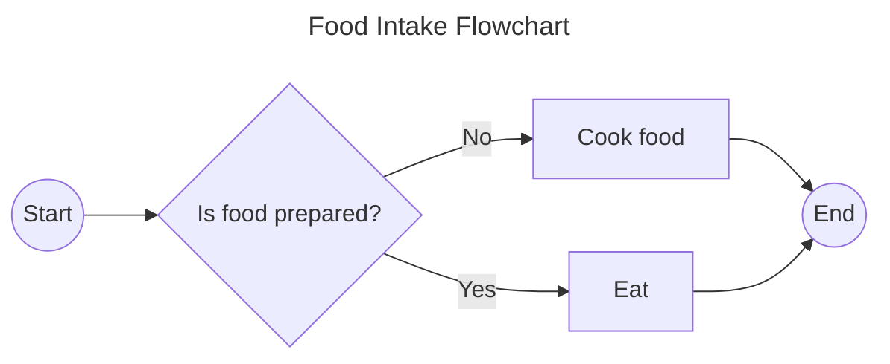
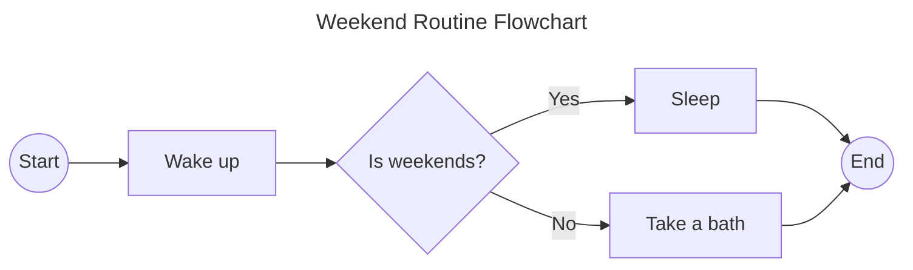
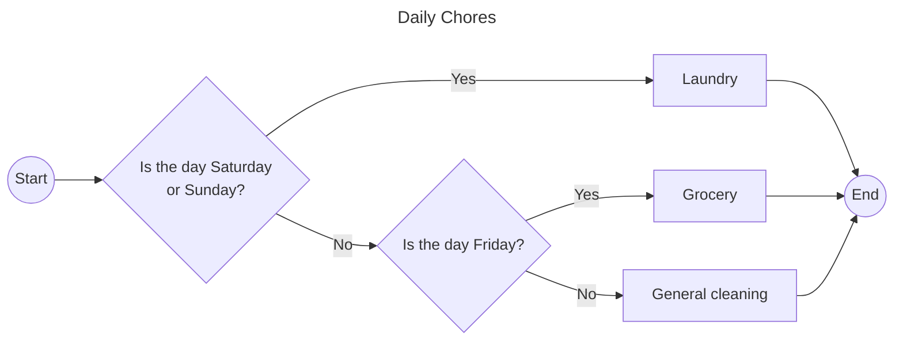
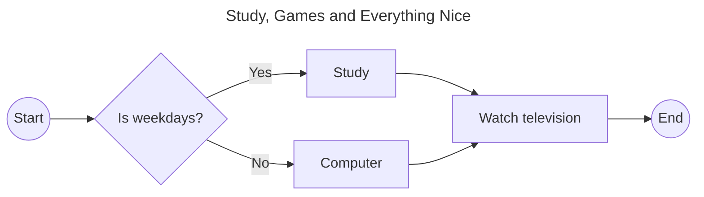
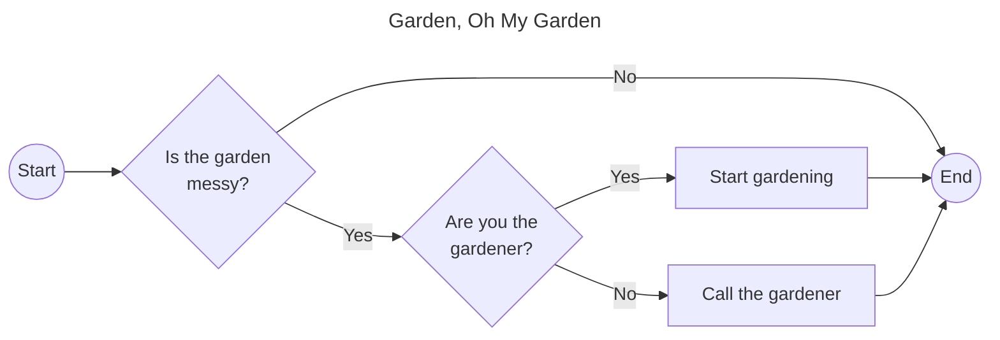

# Week 002 - Problem Solving through Flowcharts 1

## Problem #1 - Food Intake

### Problem Statement

One of our daily routines is eating. However, you can only eat if there is food already prepared for you. If there are none, you should cook food on your own before you take a big gulp.

### Flowchart



### Pseudocode

```
FoodIntake()
1. DECLARE isFoodPrepared
2. SET isFoodPrepared TO CheckIfFoodIsPrepared()
3. IF NOT isFoodPrepared THEN
4.    CALL PrepareFood()
5. END
6. CALL EatFood()
```

## Problem #2 - Weekend Routine

### Problem Statement

Is it weekends? Is it weekends? That is one of the questions we ask ourselves daily. We wake up in the morning, check if it is weekends already. If it is, we sleep again. If it is not, we take a bath.

### Flowchart



### Pseudocode

```
WeekendRoutine()
1. DECLARE isWeekends
2. SET isWeekends TO CheckIfWeekends()
3. IF isWeekends THEN
4.    CALL Sleep()
5. ELSE
6.    CALL TakeBath()
7. END

```

## Problem #3 - Daily Chores

### Problem Statement

We are given chores depending on the day. On weekends, we are tasked to do the laundry. On weekdays except Friday, we are tasked to do a general cleaning. On Fridays, we are tasked to a grocery spree.

### Flowchart



### Pseudocode

```
DailyChores()
1. DECLARE day
2. SET day TO GetDay()
3. IF day = “Saturday” OR day = “Sunday” THEN
4.    CALL DoLaundry()
5. ELSE IF day = “Friday” THEN
6.    CALL DoGrocery()
7. ELSE
8.    CALL DoGeneralCleaning()
9. END
```

## Problem #4 - Study, Games and Everything Nice

### Problem Statement

As students, we were forced to a study habit. On weekdays, we are to study our lessons. On weekends, we are free to play with the computer. After studying and playing computer games, we still have time to watch television.

### Flowchart



### Pseudocode

```
StudyGamesAndEverythingNice()
1. DECLARE isWeekend
2. SET isWeekend TO GetIsWeekend()
3. IF isWeekend THEN
4.    CALL DoStudyLesson() 
5. ELSE
6.    CALL DoPlayComputer()
7. END
8. CALL DoWatchTelevision()
```

## Problem #5 - Garden, Oh My Garden

### Problem Statement

Imagine a huge house with a beautiful garden. With that, you need to ensure the garden is kept well-maintained. If it is messy, you should do something about it. If you are the owner, call the caretaker to do the gardening; if not, do the gardening yourself.

### Flowchart



### Pseudocode

```
GardenOhMyGarden()
1.  DECLARE isGardenMessy, amIOwner
2.  SET isGardenMessy TO GetIsGardenMessy()
3.  SET amIOwner TO GetAmIOwner()
4.  IF isGardenMessy THEN
5.     IF amIOwner THEN
6.         CALL CallGardener() 
7.     ELSE
8.         CALL DoGardening()
9.     END
10. END
```
