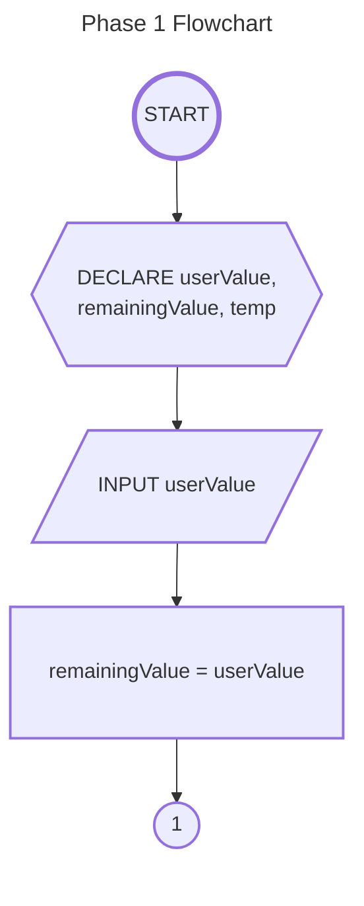
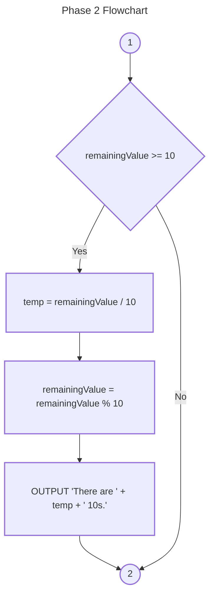
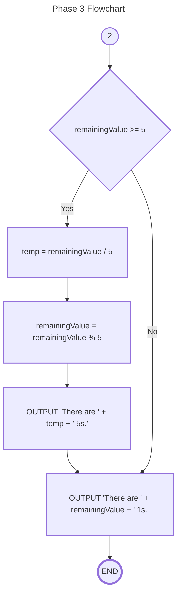

# Week 003 - Problem Solving through Flowcharts 2

## Problem Statement

Write a program that accepts an integer input from the user and display the least number of combinations of 10s, 5s, and 1s.

## Phase 1

## Phase 2

## Phase 3

